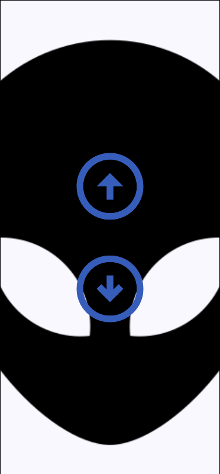

# 📱 Volume Controller - Android App

Este é um aplicativo Android desenvolvido com **Jetpack Compose** para controlar o volume de um sistema remoto via **UDP**, com uma interface fluida, animada e responsiva. Ele envia comandos de volume para um servidor, que pode repassar as atualizações via WebSocket para clientes como um aplicativo WPF.

---

## 🖼️ Interface



---

## 🔧 Funcionalidades

- Botões animados para aumentar/diminuir o volume
- Envio de comandos via protocolo **UDP**
- Comunicação assíncrona com **Ktor UDP client**
- Arquitetura baseada em **hooks** (inspirado em React)
- UI moderna usando **Jetpack Compose**
- Design responsivo com tema escuro

---

## 🚀 Tecnologias Utilizadas

- [Jetpack Compose](https://developer.android.com/jetpack/compose)
- [Ktor Networking](https://ktor.io/)
- [Kotlin Coroutines](https://kotlinlang.org/docs/coroutines-overview.html)
- [Material3](https://m3.material.io/)
- Arquitetura desacoplada com View + Model + Hook

---

## 📡 Comunicação

### 🔸 Envio UDP

O app envia mensagens para o servidor UDP:

- Exemplo de mensagem:
  - `"50+"`: aumenta o volume para 51
  - `"50-"`: diminui para 49

### 🔹 Configuração do Servidor

O servidor espera mensagens no IP e porta definidos em:

```kotlin
private const val SERVERIP = "localhost"
private const val SERVERPORT = 3000
```
